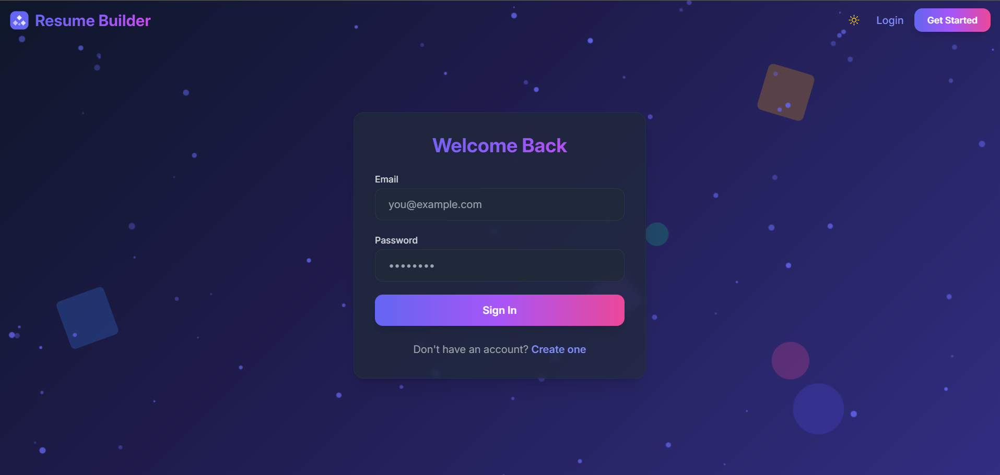
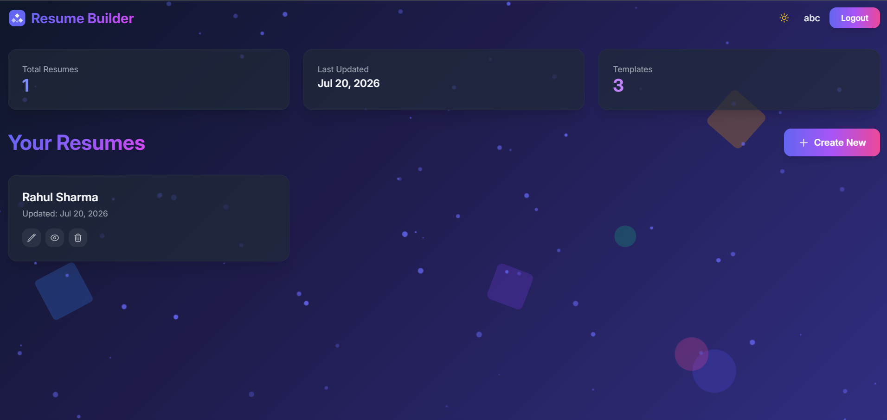

# 🚀 Resume Builder with AI Suggestions

<div align="center">


### Build professional resumes with AI-powered suggestions, multiple templates, and instant PDF export.

[Live Demo](https://resume-builder-one-cyan-82.vercel.app/login) 

</div>

---

# 📸 Screenshots

<div align="center">

<br><br>

</div>

---

# ✨ Features

## 🎯 Core Features

- ✅ User Authentication – Secure JWT-based login/register system
- ✅ Resume Builder – Create and edit resumes with dynamic sections
- ✅ 8 Professional Templates
- ✅ AI-Powered Suggestions
- ✅ Live Preview
- ✅ PDF Export
- ✅ Dark/Light Mode
- ✅ Responsive Design

## 🎨 Premium Design

- ✨ Glassmorphism UI
- 🌈 Animated Gradients
- 🎭 3D Tilt Effects
- 💫 Floating Particles
- 🎪 Smooth Page Transitions

---

# 🛠️ Tech Stack

## Frontend

| Technology | Description |
|------------|-------------|
| React 18 | UI library |
| Vite | Build Tool |
| Tailwind CSS | Styling |
| React Router | Routing |
| React Hook Form | Form Validation |
| Axios | HTTP Client |
| HTML2Canvas + jsPDF | PDF Export |
| Heroicons | Icons |

## Backend

| Technology | Description |
|------------|-------------|
| Node.js | Runtime |
| Express.js | REST API |
| MongoDB Atlas | Database |
| Mongoose | ODM |
| JWT | Authentication |
| Bcrypt | Password Hashing |
| OpenAI API | AI Suggestions |

---

# 📁 Project Structure

```text
resumeBuilder/
│
├── backend/
│   ├── .env
│   ├── package.json
│   ├── server.js
│   ├── config/
│   │   ├── db.js
│   │   └── openai.js
│   ├── models/
│   │   ├── User.js
│   │   └── Resume.js
│   ├── controllers/
│   │   ├── authController.js
│   │   ├── resumeController.js
│   │   └── aiController.js
│   ├── routes/
│   │   ├── authRoutes.js
│   │   ├── resumeRoutes.js
│   │   └── aiRoutes.js
│   └── middleware/
│       ├── auth.js
│       ├── errorHandler.js
│       └── validation.js
│
└── frontend/
    ├── .env
    ├── package.json
    ├── vite.config.js
    ├── tailwind.config.js
    ├── index.html
    └── src/
        ├── main.jsx
        ├── App.jsx
        ├── index.css
        ├── components/
        │   ├── Navbar.jsx
        │   ├── ProtectedRoute.jsx
        │   ├── common/
        │   │   ├── LoadingSpinner.jsx
        │   │   ├── Particles.jsx
        │   │   └── FloatingShapes.jsx
        │   ├── ResumeForm/
        │   │   ├── ResumeForm.jsx
        │   │   ├── PersonalInfo.jsx
        │   │   ├── Summary.jsx
        │   │   ├── Education.jsx
        │   │   ├── Experience.jsx
        │   │   ├── Skills.jsx
        │   │   ├── Projects.jsx
        │   │   ├── Certifications.jsx
        │   │   └── Achievements.jsx
        │   ├── ResumePreview/
        │   │   ├── Preview.jsx
        │   │   ├── PDFExport.jsx
        │   │   └── templates/
        │   │       ├── Template1.jsx  # Modern
        │   │       ├── Template2.jsx  # Minimal
        │   │       ├── Template3.jsx  # Creative
        │   │       ├── Template4.jsx  # Elegant
        │   │       ├── Template5.jsx  # Compact
        │   │       ├── Template6.jsx  # Executive
        │   │       ├── Template7.jsx  # Tech
        │   │       └── Template8.jsx  # Classic
        │   └── AIAnalyzer.jsx
        ├── pages/
        │   ├── Login.jsx
        │   ├── Register.jsx
        │   ├── DashboardPage.jsx
        │   ├── CreateResume.jsx
        │   ├── EditResume.jsx
        │   └── ViewResume.jsx
        ├── context/
        │   ├── AuthContext.jsx
        │   └── ThemeContext.jsx
        ├── services/
        │   ├── api.js
        │   ├── authService.js
        │   ├── resumeService.js
        │   └── aiService.js
        └── hooks/
            └── useAuth.js
```

---

# 🚀 Quick Start

## Prerequisites

- Node.js v16+
- npm or yarn
- MongoDB Atlas
- OpenAI API Key (Optional)

## 1. Clone Repository

```bash
git clone https://github.com/nilesh0509/resumeBuilder.git

cd resumeBuilder
```

## 2. Backend Setup

```bash
cd backend

npm install

cp .env.example .env

npm run dev
```

## 3. Frontend Setup

```bash
cd frontend

npm install

cp .env.example .env

npm run dev
```

## 4. Open Application

```
Frontend : http://localhost:5173
Backend  : http://localhost:5000
```

---

# 🔧 Environment Variables

## Backend

```env
PORT=5000

MONGO_URI=mongodb+srv://<username>:<password>@cluster.mongodb.net/resume_builder

JWT_SECRET=your_jwt_secret_key

```

## Frontend

```env
VITE_API_URL=http://localhost:5000/api
```

---

# 📡 API Documentation

## Authentication

| Method | Endpoint | Description |
|---------|----------|-------------|
| POST | /api/auth/register | Register |
| POST | /api/auth/login | Login |
| GET | /api/auth/me | Current User |

## Resume

| Method | Endpoint |
|---------|----------|
| GET | /api/resumes |
| GET | /api/resumes/:id |
| POST | /api/resumes |
| PUT | /api/resumes/:id |
| DELETE | /api/resumes/:id |

## AI

| Method | Endpoint |
|---------|----------|
| POST | /api/ai/analyze |

---

# 🎨 Templates

| # | Template | Best For |
|---|----------|-----------|
| 1 | Modern | Tech |
| 2 | Minimal | ATS |
| 3 | Creative | Designers |
| 4 | Elegant | Executives |
| 5 | Compact | Experienced Professionals |
| 6 | Executive | Leadership |
| 7 | Tech | Developers |
| 8 | Classic | Traditional Industries |

---

# 🚀 Deployment

## Backend (Render)

```bash
# Push repository

# Create Render Web Service

# Add environment variables

# Deploy
```

## Frontend (Vercel)

```bash
npm install -g vercel

cd frontend

vercel
```

---

# 💡 AI Resume Analysis

- 📊 Resume Score
- ✍️ Grammar Suggestions
- 🔑 ATS Optimization
- 💪 Achievement Recommendations
- 🎯 Missing Keywords
- 📝 Better Project Descriptions

---

# 🌓 Dark / Light Mode

Theme preference is automatically saved in localStorage.

---

# 🤝 Contributing

```bash
git checkout -b feature/AmazingFeature

git commit -m "Add Amazing Feature"

git push origin feature/AmazingFeature
```

Then open a Pull Request.

---

# 📝 License

Licensed under the MIT License.

---

# 🙏 Acknowledgments

- MongoDB Atlas
- Vercel
- Render
- Tailwind CSS
- Heroicons

---

# 📞 Contact

**GitHub:** @nilesh0509

**Email:** nilesh12105@gmail.com

**LinkedIn:** nilesh12105

---

<div align="center">

⭐ If you found this project helpful, please give it a star!

Made with ❤️ by **Nilesh**

</div>
